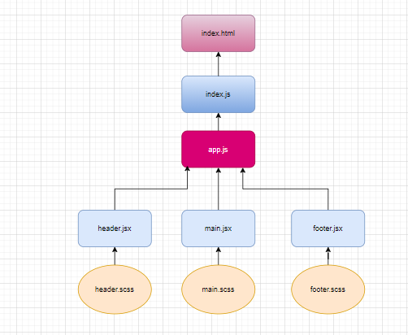

# resty
## Author: Neveen Beiram.
***
### Deployment

phase1: [Heroku](https://neveen-resty.herokuapp.com/)

phase2: [deployment on GitHub pages](https://neveenbeiram.github.io/resty/)

***

[PR](https://github.com/NeveenBeiram/resty/pulls)
***
### Running the app 

`npm start`
***
### UML
phase1:

phase2:

